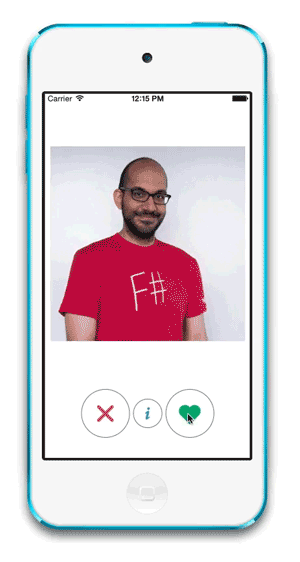

Shallow
=======

### About

In my experience, when people discuss F# someone inevitably asks "but is it good for creating user interfaces?" Many people, even some F# programmers, are under the impression that because F# is great for analysis, that it's somehow relatively unsuitable for UI programming. Nonsense! I made this small sample app to show that you can easily–even delightfully–do UIs in F#.
